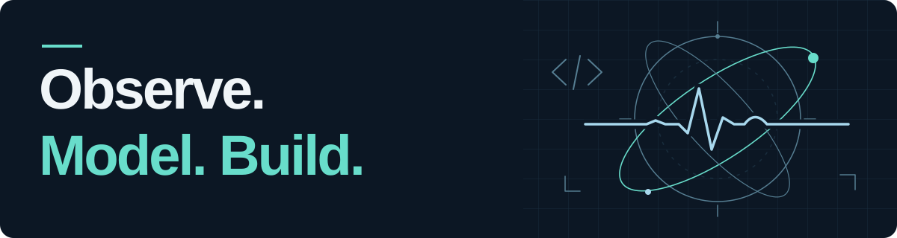

<picture>
  <source media="(prefers-color-scheme: light)" srcset="./assets/science-header-light.svg">
  <source media="(prefers-color-scheme: dark)" srcset="./assets/science-header-dark.svg">
  
</picture>

# Diego L. Malpica, MD

**Physician · Aerospace medicine specialist · Research software developer**

I investigate human performance in extreme environments and build tools that connect physiological signals, computational models and experimental research.

## Research focus

| Area | Questions and methods |
| :--- | :--- |
| **Extreme environments** | Hypoxia, acceleration physiology, fatigue and circadian rhythms. |
| **Physiological computing** | Cardiovascular signals, heart rate variability and workload assessment. |
| **Research engineering** | Sensor integration, experimental interfaces and interpretable models. |

## Selected public work

| Project | Purpose |
| :--- | :--- |
| **[OpenMATB](https://github.com/strikerdlm/OpenMATB)** | Public fork of the Multi-Attribute Task Battery for multitasking and workload experiments. |
| **[Hexoskin WAV Analyzer](https://github.com/strikerdlm/hexoskin-wav-analyzer)** | Physiological waveform and heart rate variability analysis for space-analog research. |
| **[ROBD2 Interface](https://github.com/strikerdlm/ROBD2_GUI)** | Experimental diagnostic and data-logging interface for supervised hypoxia research. |
| **[Meteor](https://github.com/strikerdlm/meteor)** | Satellite-pass prediction, capture scheduling and decoding workflows. |

[Explore all public repositories →](https://github.com/strikerdlm?tab=repositories)

<strong>Methods &amp; tools</strong>

**Code:** Python · TypeScript · JavaScript · C++ · Shell  
**Analysis:** NumPy · pandas · SciPy · MNE · NeuroKit2  
**Prototyping:** ESP32 · Arduino · Raspberry Pi

I value reproducible workflows, transparent assumptions and validation before operational use.

Research and educational software is not a substitute for validated clinical or operational systems. Follow each project's documentation and limitations.

---

**Connect** · [ORCID](https://orcid.org/0000-0002-2257-4940) · [LinkedIn](https://www.linkedin.com/in/diegolmalpica/) · [Email](mailto:dlmalpica@me.com)
